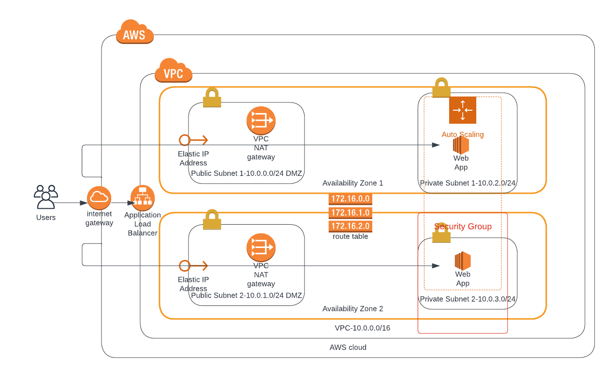

### Project Title - Deploy a high-availability web app using CloudFormation

#### final-project-starter.yml
This YAML template is for building the cloud infrastructure. 

#### server-parameters.json
This JSON file contains several paramaters as "EnvironmentName", "VpcCIDR","PublicSubnet1CIDR", "PublicSubnet2CIDR", "PrivateSubnet1CIDR" and "PrivateSubnet2CIDR" to be used in the YAML code.
For instance the `${EnvironmentName}` would be substituted with `UdacityProject`.

### Running the code
From VS Code terminal:  .\create.sh UdacityProject final-project-starter.yml server-parameters.json

From GitBash: bash create.sh UdacityProject final-project-starter.yml server-parameters.json